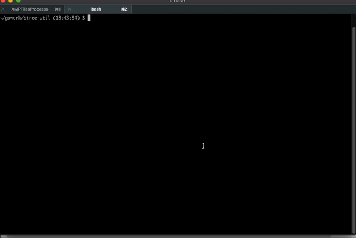
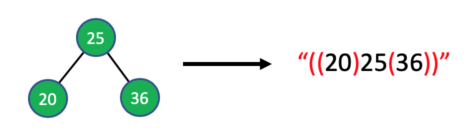
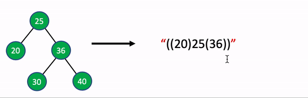
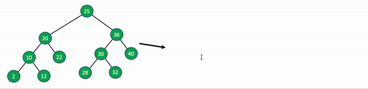

# btree-util

btree-util is a tiny package to initialize a Binary tree with custom data and also graphically display binary tree. btree-util doesn't depend on any other packages, it's completely independent and needs just your Go core. It was tested in OSx and Windows but should work on any GUI based operating system

## Background

Ever came accross a scenario where you want to write an alogorithm on Binary Tree but had to write code to create a Tree first? Ever wondered how your binary tree looks after some manipulations? You would have traversed the tree and printed to see it's current state but wouldn't it be cool to see the Tree in a Tree shape! 

Btree-util does the job for you for all you Go programm Binary tree needs. Btree-util is a tiny package that helps you initialize a Binary tree with choice of data so that you can get started with applying your Btree algorithms right away. What's cool is you can graphically see how your tree looks like at a given point in your flow

## Getting started

Follow the instructions here [https://golang.org/doc/install](https://golang.org/doc/install) if you don't have Go installed on your machine already

In your choice of terminal, execute `$ go get github.com/anandkilli/btree-util/btree` to install btree-util Go package

## How it works

Check the included example program `examples/deleteNode.go` to jump start

The package includes the following 4 functions

1. [Init](#init)
2. [BtreeToHtml](#btreetohtml)
3. [HPrintln](#hprintln)
4. [DrawBtree](#drawbtree)

## Init

This method accepts a string representation of a Binary tree and create the tree for you. 
```Go
treeString := "(((2)10(12))20(22))25(((28)30(32))36(40))"
bt := btree.Init(treeString)
```
The string format that is used here is not standard but very easy to convert a tree in mind to string and viceversa easily.

Followng is how a simplestic tree with a parent and 2 child nodes look like


Now let's add 2 more child nodes to node 36


Isn't it easy? With this format you can break string into tree format using any editor that highlights balancing parenthesis. Let's look at converting the whole tree in our example programm into a string representation


## BtreeToHtml

This method consumes your tree and converts it to a HTML represenation. Wait a minuite! Why HTML is coming into picture. Don't worry, will walk you through my pain. First, let's look at the syntax

```Go
btree.BtreeToHtml(bt)
//This doesn't show the tree, just converts and keeps the markup with it 
//33so that you can call this multiple times to see state of your binary tree at various stages of flow
```
Coming back to why I choose HTML, Go doesn't have a built in support for showing Graphics. There are third party packages available that initalizes graphics for a target operating system using OS level APIs like DirectX and OpenGL. Go doesn't install packages that a third party package depends on. When I started playing around with few popular Graphics packages, I was forced to install many other missing packages and some of them are Operating system dependent.

I had very little success after a lot of time and energy spent on it. Even if I could make it work on one operating system, there is no guranty that it will work elsewhere. On top of that, I need to guide people on how to install all the dependent packages for them to use this package. Not very convienient.

So I have started looking into options where one can use this package with less to no hassle. Then HTML came to rescue(I am a web developer by profession so I know this guy). Go support web development. Go can run OS commands. Problem solved. I will draw binary tree in HTML, serve it by starting a http server and fire OS command to open default brrowser to show the tree. Neat!

## HPrintln

This function helps push any info messages to HTML markup. This way you don't have to look at console for some messages and browser for visual of binary tree

```Go
btree.HPrintln("Tree after deleting 25 and 36")
//OR
btree.HPrintln("Tree after deleting %d and %d",25,36)
```

## DrawBtree

This function opens your default browser and displays all the markup that is staged so far, i.e the output of BtreeToHtml() and HPrintln()

```Go
btree.DrawBtree()
```
> Note that calling this method halts your execution as it start a http server and listens on 8500 port. Please call this method at the end of your programm. Press Ctrl + C to terminate and relaunch 
